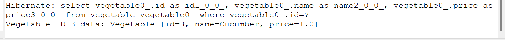
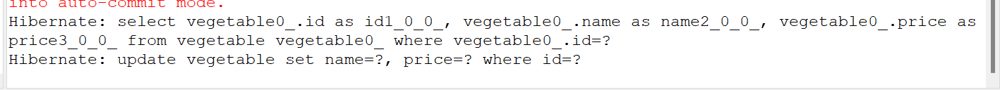
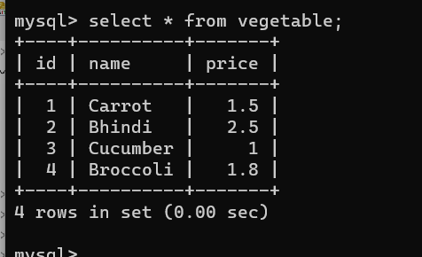
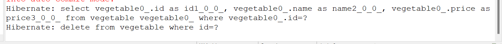
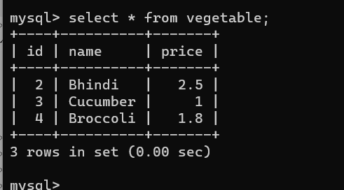

# CRUDvegetable-Hibernate
This repository showcases a Java application for managing vegetable data using Hibernate, a powerful Object-Relational Mapping (ORM) framework. The project provides a practical example of CRUD operations (Create, Read, Update, Delete) for vegetable records in a database, making it a valuable resource for learning Hibernate and building data management applications.

<h1>Create</h1>

<h1>Read</h1>

<h1>Update</h1>

<h1>Delete</h1>

